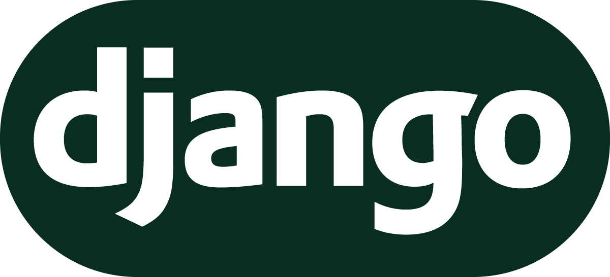

  

   
    
    

      <h1 align="center">Hi there, I'm Vladimir
      </h1>
      <h1 align="center">
    

  

  </h1>

## About me

Hello everyone! My name is Vladimir Tsurkanov. I am a C++/Python developer. My journey in IT started with a project at Sberbank’s School21. Over two years I studied programming and everything related to it in C++.
Now I am studying Python + Django/Fast api for web development.

At School 21, I completed over 20 projects of varying complexity that could take anywhere from 150 to 400 hours to complete. The tasks ranged from coding various algorithms, to using design patterns.

The essence of the training was the peer-to-peer methodology. This is when you don't have teachers, but you have other students of different ages and levels of knowledge. With this methodology I found a lot of like-minded people and my friend and part-time mentor. After a year, I was already gathering teams and designing future studying projects myself.

## Stack

  &nbsp
  &nbsp
  &nbsp
  &nbsp
  &nbsp
  &nbsp
  &nbsp

## :fire: My Stats

---
